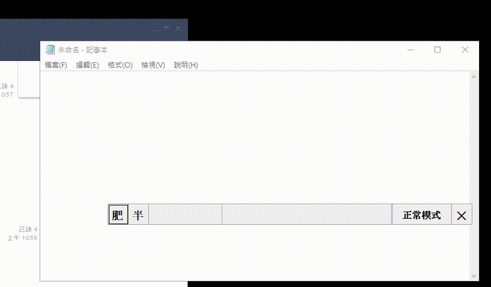
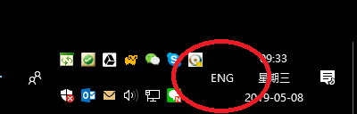
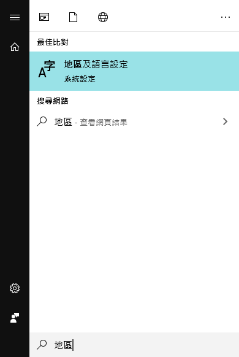
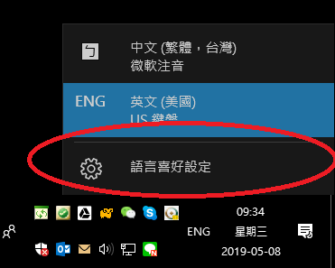
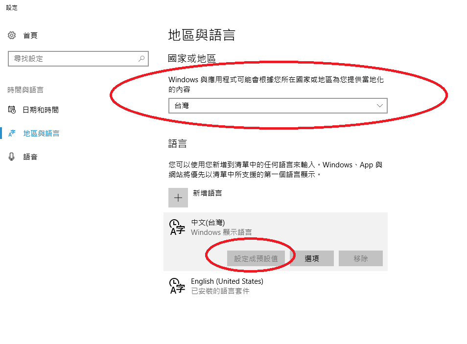
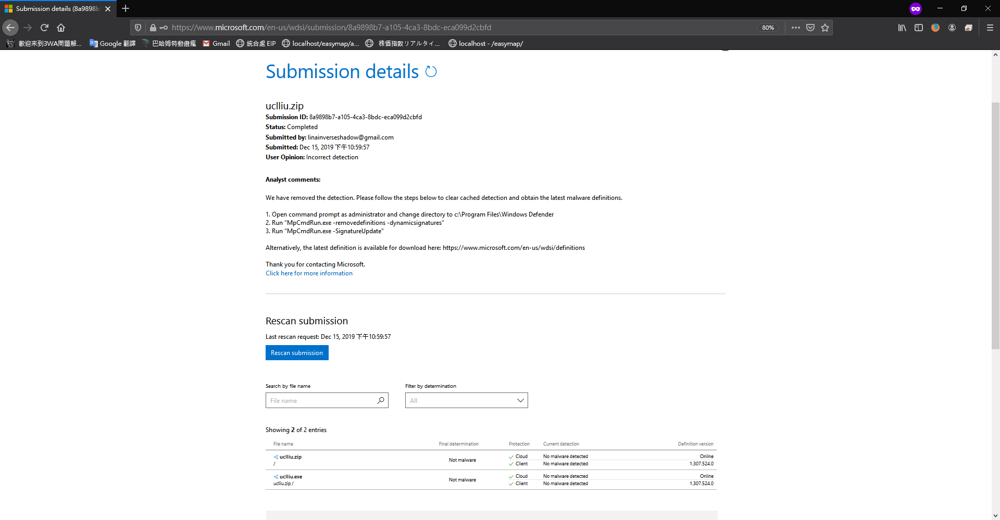

# UCL_LIU CSharp
利用 C# 開發的仿蝦米，肥米輸入法 
 

  
    
    

 
<h3>作者：</h3>
  羽山秋人 (<a target="_blank" href="http://3wa.tw">http://3wa.tw</a>) 
<h3>信箱：</h3>
  <a target="_blank" href="mailto:uclliu.3wa@gmail.com">uclliu.3wa@gmail.com</a> 
 
<h3>最初開發日期：</h3>2019-12-12 22:24 
<h3>最後更新日期：</h3>2019-12-15 23:01
 
<h3>版本：</h3>V 0.1 
 
<h3>版權：</h3>
　免錢的 MIT-License
 
<h3>下載位置：</h3>
　　1.主程式：<a download="uclliu.exe" target="_blank" href="https://raw.githubusercontent.com/shadowjohn/UCL_LIU_CSharp/master/dist/uclliu.exe">https://raw.githubusercontent.com/shadowjohn/UCL_LIU_CSharp/master/dist/uclliu.exe</a> 
　　2.同音字庫：<a download="pinyi.txt" target="_blank" href="https://raw.githubusercontent.com/shadowjohn/UCL_LIU_CSharp/master/dist/pinyi.txt">https://raw.githubusercontent.com/shadowjohn/UCL_LIU_CSharp/master/dist/pinyi.txt</a> 
　　3.字根檔(liu.json) 因版權問題無法提供  
 
 

<h3>使用方法：</h3>
　　1、您可以只下載dist/uclliu.exe 
　　2、將 「liu.json」與 uclliu.exe 放一起 
　　3、執行 uclliu.exe 即可開始使用 　　
　　4、下載 pinyi.txt 與 uclliu.exe 放一起執行，同音字庫，如「'pns」，會出現「0你 1妳 2擬 3禰 4儗 5旎...」同音選擇。 
　　5、「正常模式」=「,,,unlock」：平常打字用。 
　　6、「遊戲模式」=「,,,lock」：玩遊戲時用，如CS:GO，需要按著Shift消音走路。 
　　(如果忽然無法打字，也許就是進了「遊戲模式」請按「,,,unlock」解除。) 
　　7、「查看目前版本」=「,,,version」  
　　8、「簡體／繁體」模式 「,,,c」「,,,t」 切換 
　　9、UI 變窄「,,,s」  
　　10、UI 變寬「,,,l」  
　　11、UI 變大「,,,+」  
　　12、UI 變小「,,,-」  
　　13、把框選的文章變成字根「,,,z」  
　　14、把框選的字根變回文章「,,,x」  
　　15、UCLLIU.ini 
　　　　[DEFAULT] 
　　　　short_mode = 0  # 是否為「短」版模式， 0 或 1 
　　　　zoom = 0.90  # 縮放大小 
　　　　send_kind_2_big5 = # 如 EWinner.exe 遇到此種程式，以 「big5」 方式出字  
　　　　send_kind_1_paste = # 如 putty.exe,pcman 遇到此程程式，以 「複製、貼上」 方式出字  
　　　　alpha = 1 # 透明度 
　　　　y = 950 # 肥米輸入法最後在螢幕 y 軸位置 
　　　　x = 1239 # 肥米輸入法最後在螢幕 x 軸位置 
　　16、環境設定(強列建議)： 
<kbd>
 
  <h3>建議可以跟筆者一樣</h3>
</kbd>
<kbd>
 
  <h3>或是【開始→地區】，找到【地區及語言設定】</h3>
</kbd>
<kbd>
 
  <h3>安裝一個「ENG語系」，點選【語言喜好設定】」，應該可以在控制台找到。</h3>
</kbd>
<kbd>
 
  <h3>
一、國家與地區，要選「台灣」 
二、新增語言：找到「English (United States)」加入，但【中文(台灣)要設為預設值】 
三、平常打字時，就選「ENG」打起來就會很順手。 
  </h3>
    17、(待開發)出字模式選擇： 
</kbd>
  
 
<h3>開發動機：</h3>
　　吃飽閒閒覺得人生就是該自己寫一套輸入法，然後就開始寫了。 
　　之前開發是用 python 開發，這次想挑戰看看用 Visual Studio C# 開發，總算也是順利做出來了。 
 
<h3>目前肥米輸入法支援的字碼表如下：</h3>
　　1、PIME liu.json 
　　2、UCLLIU 肥米轉出來的 liu.json 檔 
       
<h3>字碼表說明：</h3>
　　　　由於字碼表的版權問題爭議，就不放 liu.json 了，liu.json 的格式同PIME的架構。 
　　要好的字碼表的話，請買正版，將 tab->cin->json  
　　雖然很麻煩，但沒人想因為實作一套輸入法就被告翻。 
　　 

 
 
    (2019-12-15) V0.1 版：
    初步所有功能與 python 版的 UCLLIU 1.25 版相同    
 
<h3>開發工具：</h3>
  <ul>
    <li>Visual Studio 2019</li>
    <li>參考 與 NUGET：
      <ul>
        <li>(額外的參考) System.Web.Extensions</li>
        <li>(NUGET) System.JSON</li>
        <li>(NUGET) ini-parser</li>
        <li>(NUGET) ILMerge</li>
        <li>(NUGET) MSBuild.ILMerge.Task</li>
      </ul>
    </li>
    <li>字碼表亦可參考PIME裡的liu.json</li>
</ul>
 
<h3>檔案說明：</h3>
  <ul>    
    <li>(Third party) include.cs 羽山比較熟php，所以在 C# 裡實作很多 php 的函式</li>
    <li>(Third party) (nuget) System.JSON 將 liu.json 轉成 JsonValue 的方法</li>
    <li>(Third party) (nuget) ini-parser 處理 UCLLIU.ini 檔案</li>    
    <li>(Third party) (nuget) ILMerge、MSBuild.ILMerge.Task 目的是將打包後的 uclliu.exe 變成單一檔，才不會帶一堆 dll</li>
    <li>System.Web.Extensions 處理半形字轉全形字的方法</li>
    <li>字碼表亦可參考PIME或 python 版 UCLLIU 轉出來的 liu.json</li>
  </ul>
 
<h3>自行編譯：</h3>
  <ul>
    <li>1、Visual Studio 建議為 2019 (不過當初用 2015 也可以編)</li>
    <li>2、因為要使用 ILMerge、MSBuild.ILMerge.Task，所以 Framework 使用 4.5 ，如果不使用，Framework 2.0 似乎也可以</li>
  </ul>
 
 
<h3>微軟 Windows Defender 誤判與回報：</h3>

 
<h3>微軟 Windows Defender 誤判與回報歷程：</h3>
2019-12-16 V0.1 版：https://www.microsoft.com/en-us/wdsi/submission/8a9898b7-a105-4ca3-8bdc-eca099d2cbfd 
 

<h3>ToDo：</h3>
<ul>
  <li>1、短版模式打字的過程，UI loading有點重，打快一點會當機</li>
  <li>2、後選字未分頁，如「,z」</li>
  <li>3、自定詞庫遇到\n沒有正常換行</li>
  <li>(2020-01-17 Done) 4、遊戲模式、正常模式，顯示錯誤</li>
  <li>(2020-01-17 Done) 5、執行檔的 icon 調整</li>
</ul>
 
<h3>參考資料：</h3>
<ul>
  <li>1、Allow console：https://stackoverflow.com/questions/4362111/how-do-i-show-a-console-output-window-in-a-forms-application</li>
  <li>2、C# Global Keyhook：https://stackoverflow.com/questions/577411/how-can-i-find-the-state-of-numlock-capslock-and-scrolllock-in-net</li>
  <li>3、在其他 class 使用 form widget：https://stackoverflow.com/questions/12983427/accessing-forms-controls-from-another-class</li>
  <li>4、令 form 可以拖移：https://stackoverflow.com/questions/1592876/make-a-borderless-form-movable</li>
  <li>5、半形轉全形：黑暗執行序的方法：https://blog.darkthread.net/blog/strconv-half-full-width-notes</li>
  <li>6、JsonValue 處理 liu.json：https://stackoverflow.com/questions/6620165/how-can-i-parse-json-with-c</li>
  <li>7、ini-parser：https://github.com/rickyah/ini-parser</li>
  <li>8、sendkey範例：https://www.itread01.com/content/1548344359.html</li>
  <li>9、線上語法測試；https://dotnetfiddle.net/</li>     
  <li>10、英文全形，無法正確出全形字</li>
  <li>11、在ptt打字快點，輸入法容易當掉</li>    
  <li>12、支援 Ctrl + Space 切換輸入法</li>
</ul>
 
